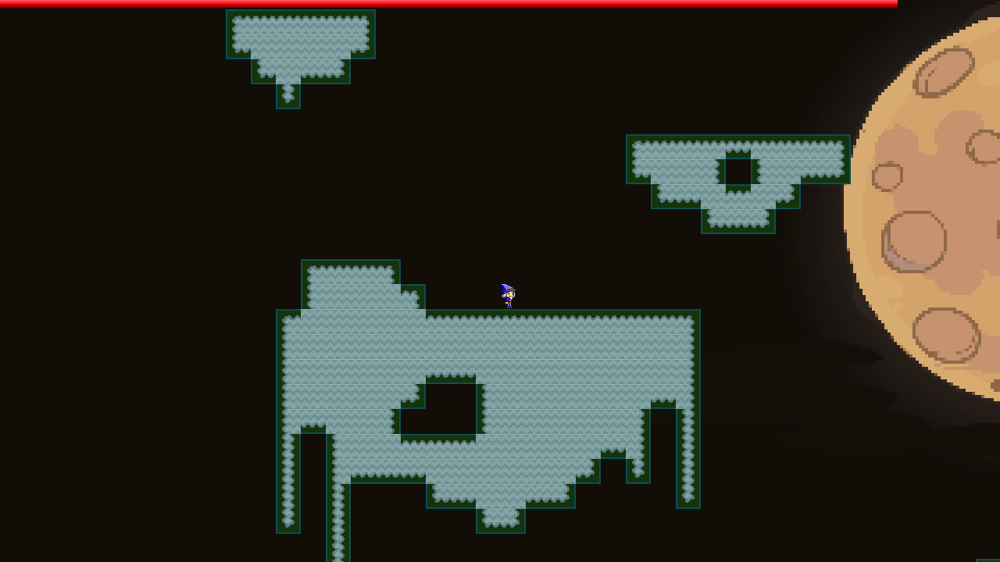
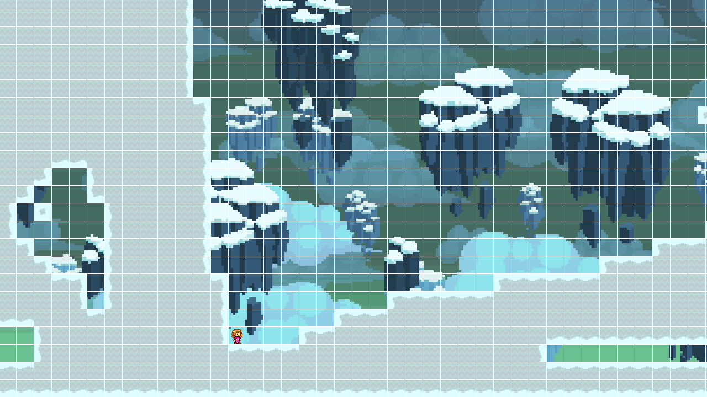

#Drawblade

####What is Drawblade?
Drawblade is a simple 2-dimensional platform game that involves levels that are a race to the finish before time is up. Find and tag the finish flag before the timer bar is empty to advance to the next level! Also, create your own levels with the Level Editor.

##### Adventure


##### Level Editor


####How can I play?
```
git clone https://github.com/BillingEmail/Drawblade.git
cd Drawblade/MainGame
make
./drawblade

The game is played with WASD, with space to jump
When using the level editor:
UIOP is used to switch between themes
WASD is used to navigate the level
The number keys are used to select what you want to place down on the map
```

####How is it made?
Drawblade is written in C, using the Simple Directmedia Layer library for graphics.
